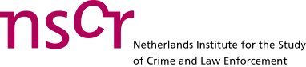
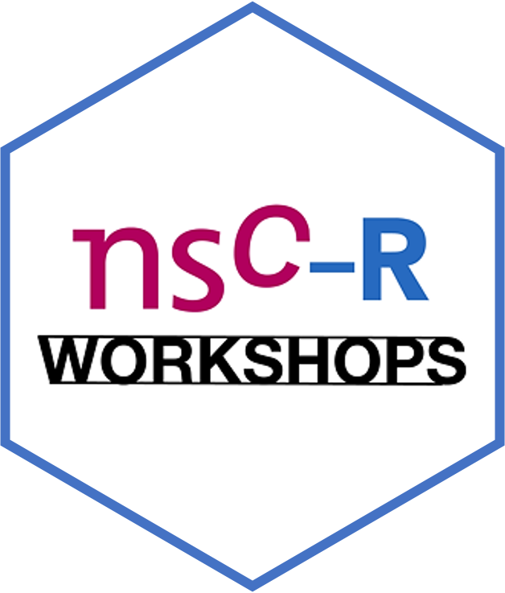

```{r setup, include=FALSE}
knitr::opts_chunk$set(echo = FALSE)

```

<center>

{width=60%}

</centre> 


### What are the NSC-R Workshops?

The **NSC-R Workshops** is a series of one-hour online instructional sessions to support participants in developing their data science skills in R, and to promote open science principles. The NSC-R workshop meetings are organized by a team mostly affiliated with the Netherlands Institute for the Study of Crime and Law Enforcement [(NSCR)](https://www.nscr.nl/en/), but they are open to everyone, regardless of affiliation or skill level. 

There are workshops on specific topics (e.g. network analysis, missing values) and `Tidy Tuesday` workshops that cover more basic skills and materials. A collection of these latter workshop materials have been brought together by Harrie Jonkman in a single document that you can find [here](  https://ttbook.netlify.app/). 

Starting November 2023 we are transforming the workshops on specific topics into a reading group, where we explore the world of data analysis using the book *Regression and other stories* by Gelman, Hill and Vehtari as a source of inspiration. Click [here](https://nscrweb.netlify.app/posts/2023-11-14-nsc-r-workshop-ros/) for more information.   

### The NSC-R Workshop Team

The NSC-R Workshop Team coordinates the NSC-R Workshops. They discuss potential topics, invite presenters, plan the meetings and send invitations. Currently the team includes Abby Onencan, Alex Trinidad, Anne Coomans, Asier Moneva, Danielle van Westbroek-Stibbe, Ida Adamse, Sam Langton and Wim Bernasco.

### Contact Us and Get involved

If you want your e-mail address on (or off) our mailing list, please send an e-mail to Wim Bernasco at wbernasco@nscr.nl.

If you have suggestions for workshop topics, or are interested in presenting one, please send a message to 
Ida Adamse (iadamse@nscr.nl)
Wim Bernasco (wbernasco@nscr.nl), 
Anne Coomans (acoomans@nscr.nl), 
Sam Langton (slangton@nscr.nl), 
Asier Moneva (amoneva@nscr.nl), 
Abby Onencan (onencan@law.eur.nl),
Alex Trinidad (atrinidad@nscr.nl), or
Danielle van Westbroek-Stibbe (DStibbe@nscr.nl).


<center>

{width=30%}

</centre> 


