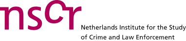
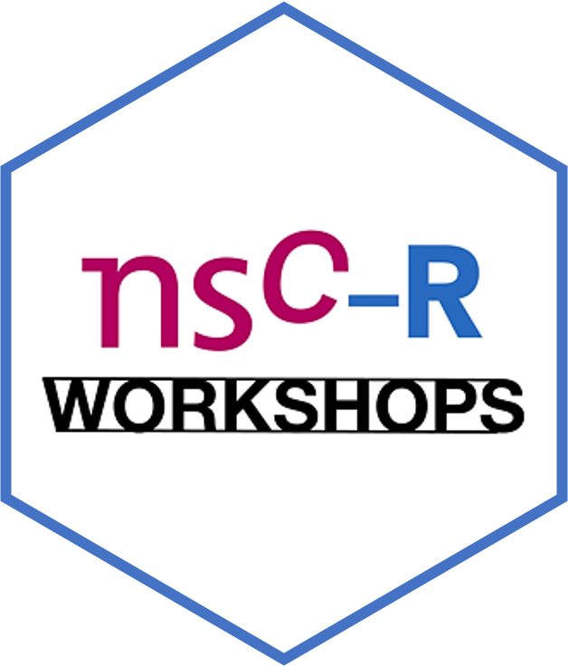

```{r setup, include=FALSE}
knitr::opts_chunk$set(echo = FALSE)

```

<center>

{width=60%}

</centre> 

### What are the NSC-R Workshops?

The **NSC-R Workshops** were a series of one‑hour online instructional sessions designed to support participants in developing their data science skills in R and to promote open science principles. These workshops took place from 2021 to 2024. The sessions were organized by a team primarily affiliated with the [Netherlands Institute for the Study of Crime and Law Enforcement (NSCR)](https://www.nscr.nl/en/), but they were open to everyone, regardless of affiliation or skill level. 

Please note that the NSC‑R online workshops were [discontinued](https://nscrweb.netlify.app/posts/2025-01-01-nsc-r-tidy-tuesday-discontinuation/) in 2025. They have been partially replaced by an in-person, four‑day Carpentries‑certified course on R for Social Scientists, which is organized and taught annually in October by the former NSC‑R workshop team.

On this website, you can still access the materials used during the sessions. Here you will find workshops on specific topics (e.g., network analysis, missing values) as well as 'Tidy Tuesday' workshops that cover more fundamental skills and materials. A collection of the latter workshop materials has been compiled by Harrie Jonkman into a single document, which can be found [here](https://ttbook.netlify.app/).

### The NSC-R Workshop Team

The NSC‑R Workshop Team coordinates the NSC‑R Workshops. They discuss potential topics, invite presenters, plan the meetings, and send out invitations. The current team members are Asier Moneva, Danielle van Westbroek‑Stibbe, and Wim Bernasco.

Past team members include Ida Adamse, Anne Coomans, Sam Langton, Abby Onencan, and Alex Trinidad.

### Contact Us and Get involved

If you want your e-mail address on (or off) our mailing list, please send an e-mail to Wim Bernasco at wbernasco@nscr.nl.

If you have suggestions for workshop topics, or are interested in presenting one, please send a message to 
Wim Bernasco (wbernasco@nscr.nl), 
Asier Moneva (amoneva@nscr.nl), or
Danielle van Westbroek-Stibbe (DStibbe@nscr.nl).


<center>

{width=30%}

</centre> 


